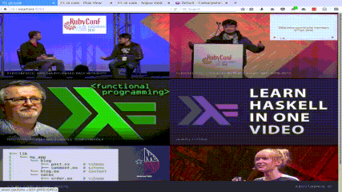

# itsallcode
This was created for my Sinatra Final Project for the Flatiron Community Bootcamp.  It allows you to input a YouTube URL and it will automatically add it to the site.  It allows for easy viewing on the front end in a image gallery like view of all the added videos.  There is a admin backend that allows for changing the YouTube url or delete the video.  It has functionality where you can create a user and login/logout.  Signups can be disabled setting the constant SIGNUP_ENABLED to false.  The youtube API key needs to be set as an environment variable, ENV_YT_API.   Also, the session secret needs to be set as well as an environment variable, ENV_ITS_ALL_CODE_SECRET.

